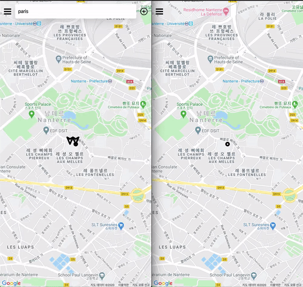

# (n)Uber 

Create uber like server with `express`, `graphql`, and `react` written in `typescript`.

## Features

- Real-time ride request and catch depend on mode driver or rider
- Real-time chat with driver and rider
- Infinit scroll for ride history
- Get direction, and render on map with `Google Map` Api
- Email and Phone verification

## What I Used

### backend
- [graphql-yoga](https://github.com/prisma-labs/graphql-yoga) for server
- [graphql](https://graphql.org/) for api
- [typeorm](https://typeorm.io/#/) for database
- [passport](http://www.passportjs.org/) for social-login
- [twilio](https://www.twilio.com/) for sms
- [nodemailer](https://nodemailer.com/about/) for email
---
### frontend
- [react](https://ko.reactjs.org/) for client
- [apollo](https://www.apollographql.com/docs/react/api/react-hooks/) for client management
- [react-router-dom](https://reacttraining.com/react-router/web/guides/quick-start) for routes
- [googlemaps](https://developers.google.com/maps/documentation/javascript/tutorial) for map api
- [styled-components](https://styled-components.com/) for style 

## What I Learned

- environment setting for frontend and backend
- implement entity and build gralhql api 
- database relations design ManyToOne, OneToMany
- jwt based authentication management
- desing pattern for react splitting presenter and container
- authenticaiton based routes handle
- build and deploy to `heroku`
- how to use graphql in react with apollo

